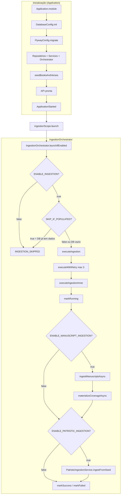
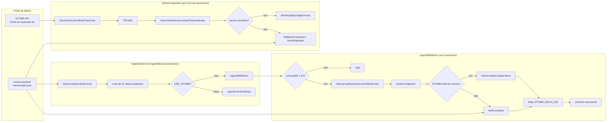
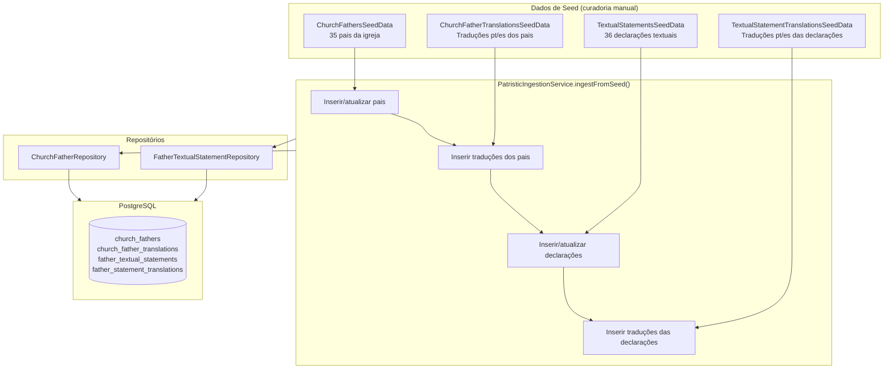
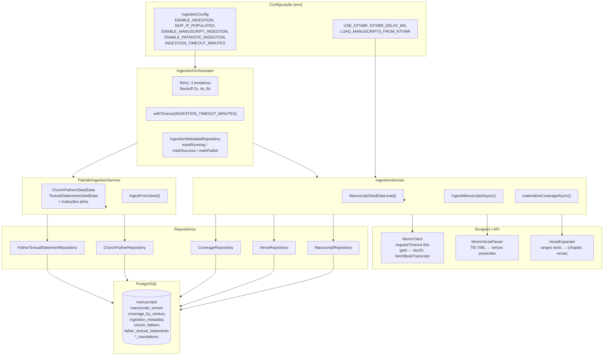

# Arquitetura da Ingestão — Manuscriptum Atlas

Diagrama do fluxo de ingestão de manuscritos, dados patrísticos e materialização da cobertura.

---

## Visão geral (fluxo de alto nível)

---

## Detalhe: ingestão de manuscritos

---

## Detalhe: ingestão patrística

- **Idempotência**: `insertIfNotExists` com chave lógica (fatherId + sourceWork + sourceReference)
- **Traduções**: seed separado para pt e es, vinculado ao registro principal por fatherId/statementId

---

## Componentes e responsabilidades

---

## Fluxo sequencial resumido

| Etapa | Componente | Ação |
|-------|------------|------|
| 1 | **Application** | `seedBooksAndVerses()` — insere 27 livros e 7.956 versículos canônicos |
| 2 | **Application** | No evento `ApplicationStarted`, dispara `orchestrator.launchIfEnabled()` em coroutine |
| 3 | **IngestionOrchestrator** | Verifica `ENABLE_INGESTION` e `INGESTION_SKIP_IF_POPULATED` (e se DB já tem manuscritos) |
| 4 | **IngestionOrchestrator** | `executeWithRetry(3)` → em falha, espera 2s / 4s / 8s e tenta de novo |
| 5 | **IngestionOrchestrator** | `executeIngestionInner()` com timeout global (ex.: 30 min) |
| 6 | **IngestionMetadataRepository** | `markRunning()` |
| 7 | **IngestionService** | Se `ENABLE_MANUSCRIPT_INGESTION=true`: `ManuscriptSeedData.load()` → manuscritos do JSON |
| 8 | **IngestionService** | Se `USE_NTVMR=true`: para cada manuscrito (século ≤ X), chama NTVMR por livro; senão usa só seed |
| 9 | **NtvmrClient** | Converte GA-ID → docID, faz GET na API NTVMR (TEI), delay 500 ms entre chamadas |
| 10 | **NtvmrVerseParser** | Extrai versículos presentes do TEI; se falhar, usa `VerseExpander` + ranges do seed |
| 11 | **VerseRepository** | `insertManuscriptVerses` — liga manuscrito aos verse_id |
| 12 | **IngestionService** | `materializeCoverageAsync()` — para séculos 1..10, calcula e persiste cobertura |
| 13 | **PatristicIngestionService** | Se `ENABLE_PATRISTIC_INGESTION=true`: seed de 35 pais + 36 declarações + traduções (pt, es) |
| 14 | **IngestionMetadataRepository** | `markSuccess(duration, manuscripts, verses)` ou `markFailed()` |

---

## Pontos de decisão

- **Lista de manuscritos:** com `LOAD_MANUSCRIPTS_FROM_NTVMR=true`, a lista vem da API NTVMR `metadata/liste/search` (140+ papiros + unciais). Caso contrário, usa `manuscripts.json`.
- **Conteúdo (quais versículos):** NTVMR API quando `USE_NTVMR=true` e a API responder; senão, ranges do seed.
- **Manuscritos vs. Patrístico:** controlados independentemente por `ENABLE_MANUSCRIPT_INGESTION` e `ENABLE_PATRISTIC_INGESTION`.
- **Ingestão automática:** só roda se `ENABLE_INGESTION != false` e (se `INGESTION_SKIP_IF_POPULATED=true`) o banco estiver vazio.
- **Ingestão manual:** `POST /admin/ingestion/run` chama `orchestrator.triggerManual(scope)` (respeitando uma única execução por vez).
- **Ingestão patrística:** idempotente via chave lógica; inclui traduções (pt, es) para pais e declarações.

Para visualizar os diagramas Mermaid, use o GitHub, o VS Code (extensão Mermaid) ou [mermaid.live](https://mermaid.live).
